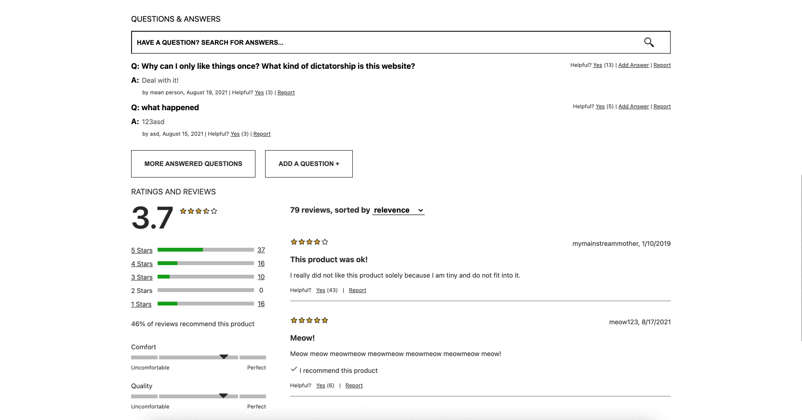
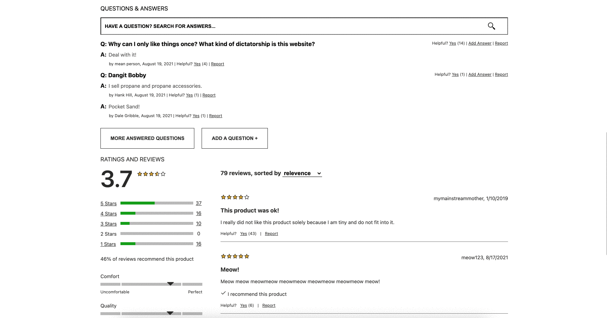
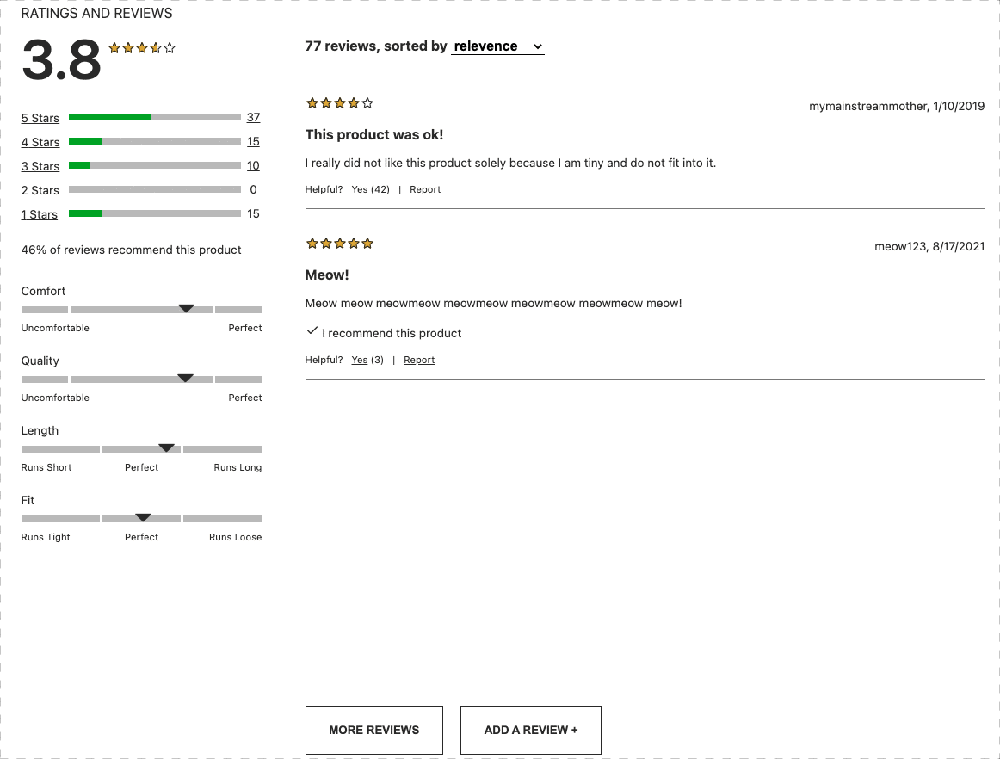

# Hack Reactor Front End Capstone Project

## OVERVIEW
This is a project we did at Hack Reactor where we built a Product Description page for an e-commerce website.

## DESCRIPTION
Our app is a single page application built with React. It includes:

(1) Product Overview that displays a large image and important information about the product

(2) Questions & Answers that allows the user to view and submit questions and answers related to the product

(3) Ratings & Reviews that features a sortable list of customer-submitted reviews.

## INSTALLATION
(1) Clone the repo

(2) Setup .env file:

Make a copy of .sample-env

Add Port Number, GitHub Token, and ImgBB Token

(3) Run:
```javascript
npm install
npm run build // production bundle
npm run dev // development bundle
npm run server:dev // nodemon
```
## WIDGETS:

### PRODUCT OVERVIEW


The product overview widget is the first thing a user sees when navigating to the page. It provides a large image and a lot of important product data.

The image can be cycled through all the available images for each product, and enlarged to a full-screen view. Once in full screen, the image can be clicked again to use a dynamic zooming effect. Moving the mouse in this mode also moves the zoom box around the image.

The details section, next to the image, contains the product category, name, and price. A series of five stars shows the average rating of the product. This section also allows the user to change the style using a set of thumbnails representing each style. Once a style is selected, the user can use a series of dropdowns to select the size (SKU) and then, finally, the quantity they would like to add to their cart. An add to cart button lies just below this with a 'favorite' button.

The product's extra section, below both the image end details section, displays a slogan, description, and some features the product has.

### QUESTIONS & ANSWERS
The Questions & Answers widget includes all user-submitted questions and answers related to the given product. The list of questions scrolls infinitely, and each question only displays two answers by default, with the option to display all answers upon clicking "Load More Answers." If there are more questions or answers than can be displayed on the page, the window is capped and the list becomes scrollable. Both questions and answers are sorted by the number of "Helpful" votes they have received - but all answers from the Seller will be listed first, with their username in bold.

Users can mark questions and answers helpful, and can also report them, which will remove them from the page. Users cannot mark something helpful more than once.


Additionally, users can submit their own answers, and upload up to five photos to be included with their answer. All photos in the widget, when clicked, expand to their full resolution.


Finally, users can submit their own questions, and can search through all questions and answers - matching text gets highlighted as the user inputs and deletes text. Both question and answer forms validate their required inputs, including email, and ensure that only images can be uploaded to the page.


### RATINGS & REVIEWS
\
The Ratings and Review Section features the average of all reviews along with a group of 5 stars, filled in based on the average reviews, rounded to the nearest quarter of a star. The section below is a breakdown of the star levels of reach review. Users can click each line, which acts as a filter to only see the desired reviews.

The product breakdown section consists of several characteristics and a slider indicating the average choice of each as submitted by users.

The heart of the Ratings and Reviews section is the product reviews themselves. Each review displays the rating shown by filled in stars, the user's review summary and content, a place for others to mark the review as helpful, and the ability to report a revew.

Below the review content, there is a button to load more reviews, and another to add a new review. This button opens a form with several fields to fill in and the ability to upload up to five product images
\
\

